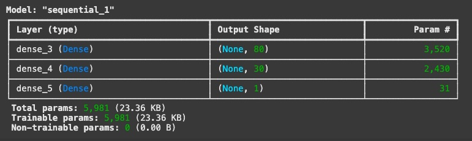
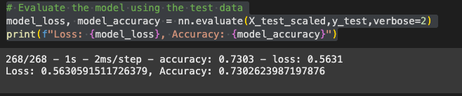
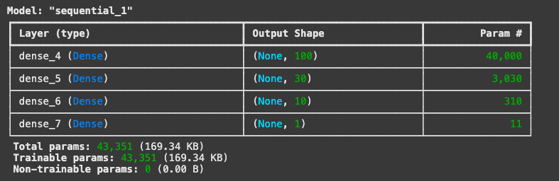
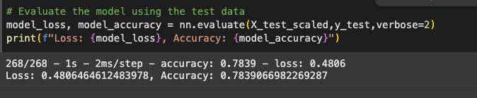

# Alphabet Soup Neural Network Model Report  

## Overview  

The purpose of this analysis is to develop a deep learning model that predicts the success of charity funding applications submitted to Alphabet Soup. By analyzing historical application data, we aim to classify applications as **successful** or **unsuccessful** based on various features.  

## Tools Used  

To develop, train, and evaluate this model, the following tools were utilized:  

- **Google Colab** – Cloud-based development environment for running Python scripts and TensorFlow models.  
- **Python** – Programming language used for data preprocessing and model development.  
- **TensorFlow/Keras** – Deep learning framework for building and training neural networks.  
- **Pandas** – Data manipulation and preprocessing.  
- **Scikit-learn** – Data preprocessing, including scaling and encoding.   

---

## Results  

### Data Preprocessing  

- **Target Variable:**  
  - `IS_SUCCESSFUL`: This binary variable indicates whether an application received funding.  

- **Feature Variables:**  
  - `APPLICATION_TYPE`  
  - `AFFILIATION`  
  - `CLASSIFICATION`  
  - `USE_CASE`  
  - `ORGANIZATION`  
  - `INCOME_AMT`  
  - `ASK_AMT`  

- **Removed Variables:**  
  - `EIN` and `NAME`: These identifiers do not contribute to the model’s predictive ability.  
  - **Low-frequency categories** in `CLASSIFICATION` were grouped into "Other" to reduce noise.  
  - **Categorical data** was converted into numeric format using `pd.get_dummies()`.  

---

### Compiling, Training, and Evaluating the Model  

#### **First Model** (Saved as `AlphabetSoupCharity.h5`)  

- **Neural Network Structure:**
  - **Input Layer:** Number of input features (determined after encoding categorical variables).  
  - **Hidden Layer 1:** 80 neurons, ReLU activation.  
  - **Hidden Layer 2:** 30 neurons, ReLU activation.  
  - **Output Layer:** 1 neuron, Sigmoid activation.  

- **Activation Functions:**  
  - **ReLU** for hidden layers to improve learning of complex patterns.  
  - **Sigmoid** for output layer to generate probabilities between 0 and 1.

- **Performance:**  
  - Accuracy: **73.03%**  
  - **Target Accuracy Not Met** (Goal: 75% or higher).  

#### **Optimized Model** (Saved as `AlphabetSoupCharity_Optimization.h5`)  

- **Optimizations Implemented:**  
  - Increased hidden layers from **two to three**.  
  - Increased the **first hidden layer neurons from 80 to 100** to improve feature extraction.  
  - Introduced a **third hidden layer** with 10 neurons.  
  - Kept **ReLU for hidden layers** and **Sigmoid for output layer**.  

- **Optimized Model Structure:**  
  - **Hidden Layer 1:** 100 neurons, ReLU activation.  
  - **Hidden Layer 2:** 30 neurons, ReLU activation.  
  - **Hidden Layer 3:** 10 neurons, ReLU activation.  
  - **Output Layer:** 1 neuron, Sigmoid activation.  

- **Final Model Performance:**  
  - **Loss:** 0.4806  
  - **Accuracy:** **78.39%** Higher than 75% *(Target Accuracy Met!)*  

---

## Summary  

- The optimized deep learning model successfully achieved an accuracy of **78.39%**, exceeding the 75% target.  
- **Key improvements** included adding a third hidden layer and adjusting neuron counts to enhance feature learning.  

### Alternative Model Recommendation  

While the neural network performed well, a different model may provide better results:  
My readining from different sources suggests: [Source](https://xgboost.readthedocs.io/en/stable/tutorials/rf.html)
- **Random Forest Classifier**  
  - Handles categorical data well.  
  - Less sensitive to data scaling than neural networks.  
  - Easier to interpret feature importance.  

- **Gradient Boosting (XGBoost)**  
  - More efficient for tabular data.  
  - Strong performance in structured data classification problems.  

Given the nature of structured, categorical data in this dataset, an **XGBoost model** may improve performance while being computationally efficient.  
 
